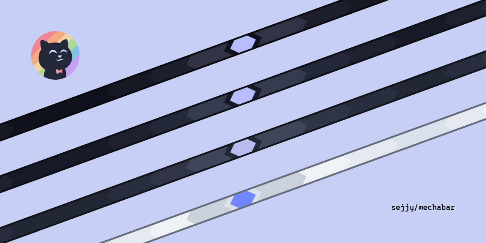
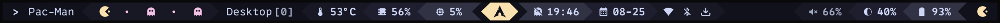

<div align="center"><h2>🤖 mechabar</h2></div>

<table>
   <tr>
      <td>
         
      </td>
   </tr>
</table>

<div align="center"><details>
   <summary><strong>Themes</strong></summary>

   <div align="left"><p>Catppuccin <strong>Mocha</strong> (<i>Default</i>)</p>
   <table>
      <tr>
         <td>
            
         </td>
      </tr>
   </table>

   <p>Catppuccin <strong>Macchiato</strong></p>
   <table>
      <tr>
         <td>
            
         </td>
      </tr>
   </table>

   <p>Catppuccin <strong>Frappe</strong></p>
   <table>
      <tr>
         <td>
            
         </td>
      </tr>
   </table>

   <p>Catppuccin <strong>Latte</strong></p>
   <table>
      <tr>
         <td>
            
         </td>
      </tr>
   </table></div>
</details>

<details>
   <summary><strong>Variants</strong></summary>

   <div align="left"><p><strong>pacman</strong> (<i>Pac-Man</i>)</p>
   <table>
      <tr>
         <td>
            
         </td>
      </tr>
   </table>
   <blockquote>Variants also come in 4 themes.</blockquote>

   <p>More variants soon!</p></div>
</details></div>

#

### Requirements

- [Waybar](https://github.com/Alexays/Waybar) **v0.13.0** is required.

  > Version **0.14.0** has an [issue](https://github.com/Alexays/Waybar/issues/4354) that breaks the module layout
  > ([#31](https://github.com/sejjy/mechabar/issues/31)).

> [!IMPORTANT]
> This config uses [`kitty`](https://github.com/kovidgoyal/kitty) to open [`fzf`](https://github.com/junegunn/fzf) menus.
> If you use a different terminal, replace all instances of `kitty` and add flags if necessary.

#

### Installation

1. Backup your current config:

   ```bash
   mv ~/.config/waybar{,.bak}
   ```

2. Clone the repository:

   - Default:

     ```bash
     git clone https://github.com/sejjy/mechabar.git ~/.config/waybar
     cd ~/.config/waybar
     ```

   - Variant:

     ```bash
     # git clone -b var/<name> https://github.com/sejjy/mechabar.git ~/.config/waybar
     # Example:
     git clone -b var/pacman https://github.com/sejjy/mechabar.git ~/.config/waybar
     cd ~/.config/waybar
     ```

3. Run the [install](/install.sh) script:

   ```bash
   ./install.sh
   ```

   > This makes [scripts](/scripts/) executable and installs all dependencies listed below:

   |                        Package | Description                                                                    |
   | -----------------------------: | ------------------------------------------------------------------------------ |
   |                        `bluez` | Daemons for the bluetooth protocol stack<tr></tr>                              |
   | (_bluetoothctl_) `bluez-utils` | Development and debugging utilities for the bluetooth protocol stack<tr></tr>  |
   |                `brightnessctl` | Lightweight brightness control tool<tr></tr>                                   |
   |                          `fzf` | Command-line fuzzy finder<tr></tr>                                             |
   |     (_nmcli_) `networkmanager` | Network connection manager and user applications<tr></tr>                      |
   |               `pipewire-pulse` | Low-latency audio/video router and processor - PulseAudio replacement<tr></tr> |
   |             `ttf-0xproto-nerd` | Patched font 0xProto from nerd fonts library                                   |

> [!TIP]
> To enable battery notifications, see the instructions in [battery-state.sh](/scripts/battery-state.sh#L5-L12).

#

### Credits

- Font: [0xProto](https://github.com/0xType/0xProto)
- Icons: [Nerd Fonts](https://github.com/ryanoasis/nerd-fonts)
- Themes: [Catppuccin](https://github.com/catppuccin/waybar)
