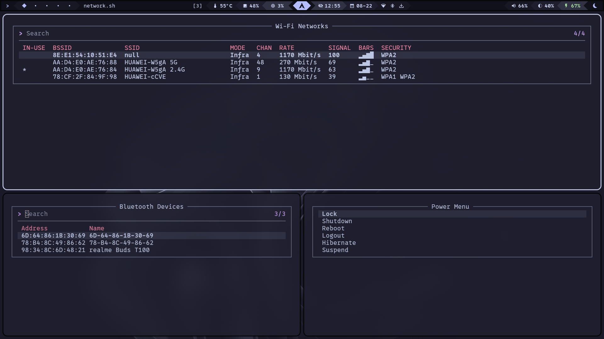

<div align="center">

```
                      ______        ______                
_______ _________________  /_______ ___  /_______ ________
__  __ `__ \  _ \  ___/_  __ \  __ `/_  __ \  __ `/_  ___/
_  / / / / /  __/ /__ _  / / / /_/ /_  /_/ / /_/ /_  /    
/_/ /_/ /_/\___/\___/ /_/ /_/\__,_/ /_.___/\__,_/ /_/     
```

|  |
| :----------------------------------------------: |

> <sup>Preview images are scaled to 125%</sup>

   <details>
      <summary>&nbsp;
         <strong>Themes</strong>
      </summary>
      <br>

Mocha

|  |
| :----------------------------------------------: |

Macchiato

|  |
| :------------------------------------------------------: |

Frappe

|  |
| :------------------------------------------------: |

Latte

|  |
| :----------------------------------------------: |

   </details>

   <details>
      <summary>&nbsp;
         <strong>
            <a href="https://github.com/junegunn/fzf">fzf</a>
            Menus
         </strong>
      </summary>
      <br>

|  |
| :--------------------------------: |

   </details>
</div>

#

### Requirements

- Waybar <= **v0.13.0**

  > Version **0.14.0** has an issue with wildcard includes. See [#4354](https://github.com/Alexays/Waybar/issues/4354).

> [!IMPORTANT]
> This config uses [`kitty`](https://github.com/kovidgoyal/kitty) to open `fzf` menus.
> If you use a different terminal, replace all instances of `kitty` and add flags if necessary.

#

### Installation

1. Backup your current config:

   ```sh
   mv ~/.config/waybar{,.bak}
   ```

2. Clone the repository:

   ```sh
   git clone https://github.com/sejjy/mechabar.git ~/.config/waybar
   cd ~/.config/waybar
   ```

3. Run the [install script](/install.sh):

   ```sh
   ./install.sh
   ```

   > This makes [scripts](/scripts/) executable and installs all dependencies listed below:

   |                        Package | Description                                                                   |
   | -----------------------------: | ----------------------------------------------------------------------------- |
   |                        `bluez` | Daemons for the bluetooth protocol stack<tr></tr>                             |
   | (_bluetoothctl_) `bluez-utils` | Development and debugging utilities for the bluetooth protocol stack<tr></tr> |
   |                `brightnessctl` | Lightweight brightness control tool<tr></tr>                                  |
   |                          `fzf` | Command-line fuzzy finder<tr></tr>                                            |
   |     (_nmcli_) `networkmanager` | Network connection manager and user applications<tr></tr>                     |
   |                     `pipewire` | Low-latency audio/video router and processor<tr></tr>                         |
   |             `ttf-0xproto-nerd` | Patched font 0xProto from nerd fonts library<tr></tr>                         |
   |        (_wpctl_) `wireplumber` | Session/policy manager implementation for PipeWire                            |

> [!TIP]
> To enable battery notifications, see the instructions in [battery-state.sh](/scripts/battery-state.sh#L5-L12).

#

### Credits

- Font: [0xProto](https://github.com/0xType/0xProto)
- Icons: [Nerd Fonts](https://github.com/ryanoasis/nerd-fonts)
- Themes: [Catppuccin](https://github.com/catppuccin/waybar)
