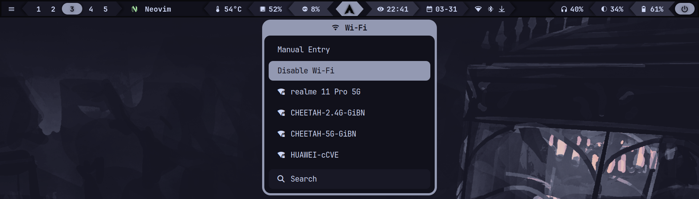
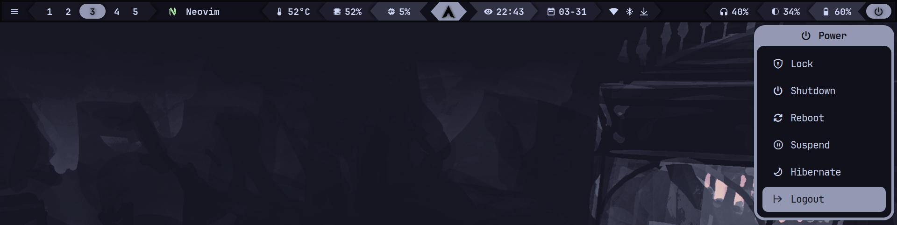

<div align="center">

# 🤖 mechabar

|  |
| :----------------------------------------------: |

  <details>
    <summary><strong>&nbsp;🎨 Themes</strong></summary>
    <br />

**Catppuccin**

|  |
| :-------------------------------------------: |

|  |
| :-------------------------------------: |

|  |
| :-----------------------------------: |

**Gruvbox**

|  |
| :------------------------------: |

|  |
| :--------------------------------: |

  </details>

  <details>
    <summary><strong>&nbsp;🚀 Menus</strong></summary>
    <br />

|                Wi-Fi                |
| :---------------------------------: |
|  |

|                  Bluetooth                   |
| :------------------------------------------: |
|  |

|                Power                 |
| :----------------------------------: |
|  |

  </details>
</div>

A mecha-themed [Waybar](https://github.com/Alexays/Waybar) configuration initially designed for [Hyprland](https://github.com/hyprwm/Hyprland), but also compatible with [Sway](https://github.com/swaywm/sway)[^1] and other [wlroots-based compositors](https://github.com/solarkraft/awesome-wlroots#compositors) with minimal adjustments.

[^1]:
    Waybar configuration guide for Sway:  
    https://github.com/Alexays/Waybar/wiki/Module:-Sway

## Classic vs Animated

You can choose between two (2) styles:

- **Classic:**

  Clone the **main** branch for the classic, non-animated bar.

  ```bash
    git clone https://github.com/sejjy/mechabar.git
    cd mechabar
  ```

- **Animated:**

  Clone the **[animated](https://github.com/sejjy/mechabar/tree/animated)** branch to try the new launch animations.

  ```bash
    git clone -b animated https://github.com/sejjy/mechabar.git
    cd mechabar
  ```

## Installation (Arch Linux)

### Automatic

1. **Run the [install script](/install.sh):**

   ```bash
   ./install.sh
   ```

   This backs up existing directories and installs all [dependencies](#dependencies), config files, and scripts.

#

### Manual

#### Dependencies

```bash
sudo pacman -S bluez-utils brightnessctl pipewire pipewire-pulse ttf-jetbrains-mono-nerd wireplumber
```

```bash
yay -S bluetui rofi-lbonn-wayland-git
```

| Package                   | Description                                                                                         |
| ------------------------- | --------------------------------------------------------------------------------------------------- |
| `bluetui`                 | TUI for managing bluetooth devices <tr></tr>                                                        |
| `bluez-utils`             | Development and debugging utilities for the bluetooth protocol stack <tr></tr>                      |
| `brightnessctl`           | Lightweight brightness control tool <tr></tr>                                                       |
| `pipewire`                | Low-latency audio/video router and processor <tr></tr>                                              |
| `pipewire-pulse`          | Low-latency audio/video router and processor - PulseAudio replacement <tr></tr>                     |
| `rofi-lbonn-wayland-git`  | A window switcher, application launcher and dmenu replacement (fork with Wayland support) <tr></tr> |
| `ttf-jetbrains-mono-nerd` | Patched font JetBrains Mono from the nerd fonts library <tr></tr>                                   |
| `wireplumber`             | Session/policy manager implementation for PipeWire                                                  |

> [!IMPORTANT]
> If you use other packages, you may need to modify the [scripts](/scripts/) and config files to match your setup.

#

#### Installation

1. **Copy config files:**

   ```bash
   mkdir -p ~/.config/waybar
   cp config.jsonc style.css theme.css ~/.config/waybar
   ```

   ```bash
   mkdir -p ~/.config/waybar/themes
   cp -r themes/* ~/.config/waybar/themes
   ```

   ```bash
   mkdir -p ~/.config/rofi
   cp rofi/* ~/.config/rofi
   ```

2. **Set up scripts:**

   ```bash
   mkdir -p ~/.config/waybar/scripts
   cp scripts/* ~/.config/waybar/scripts
   ```

   ```bash
   chmod +x ~/.config/waybar/scripts/*
   ```

3. **Restart Waybar:**

   ```bash
   killall waybar; waybar & disown
   ```

   Or specify the config paths:

   ```bash
   killall waybar
   waybar --config "$HOME/.config/waybar/config.jsonc" --style "$HOME/.config/waybar/style.css" &
   disown
   ```

## Customization

- You can switch between predefined [css](/themes/css/), [jsonc](/themes/jsonc/), and [rasi](/rofi/themes/) themes by clicking the leftmost module. To use your own theme, add a file in each directory following its format.

- You can replace modules with ones from the [modules](/modules/) folder. For a complete list of available modules, see the [Waybar Wiki](https://github.com/Alexays/Waybar/wiki).

- To change the bar height manually, see the notes in [style.css](/style.css#L359-L429)

- To set up battery notifications, follow the instructions in [battery-level.sh](/scripts/battery-level.sh#L56-L83) and [battery-state.sh](/scripts/battery-state.sh#L38-L50).

## Roadmap

Here are some features and improvements planned for future versions:

- [x] Theme switcher
- [ ] Style switcher
- [ ] Add more themes

## Credits

- Font icons: [ryanoasis / nerd-fonts](https://github.com/ryanoasis/nerd-fonts)
- Color palette: [catppuccin / catppuccin](https://github.com/catppuccin/catppuccin), [morhetz / gruvbox](https://github.com/morhetz/gruvbox)
- The original files in the [modules](/modules/) folder are from [prasanthrangan / hyprdots](https://github.com/prasanthrangan/hyprdots).
- The original versions of [battery-level.sh](/scripts/battery-level.sh) and [battery-state.sh](/scripts/battery-state.sh) are from [ericmurphyxyz / dotfiles](https://github.com/ericmurphyxyz/dotfiles)
- Special thanks to [JustLap](https://github.com/JustLap) for helping me organize font sizes into a [dedicated section](/style.css#L359-L429).
