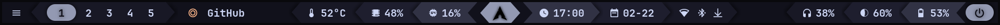
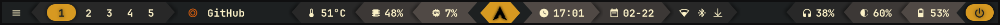
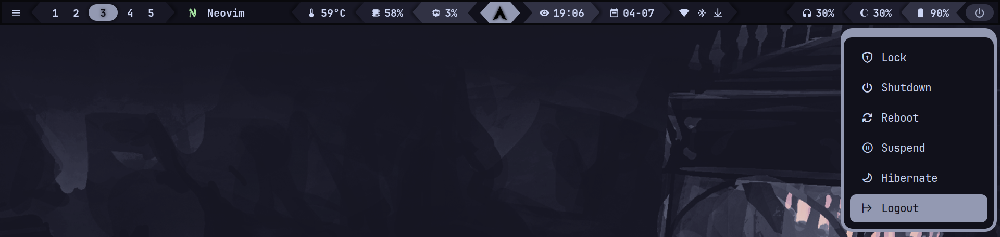

<div align="center">

## 🤖 mechabar

|  |
| :----------------------------------------------: |

  <details>
    <summary><strong>&nbsp;🎨 Themes</strong></summary>
    <br />

**Catppuccin**

|  |
| :-------------------------------------------: |

|  |
| :-------------------------------------: |

|  |
| :-----------------------------------: |

**Gruvbox**

|  |
| :------------------------------: |

|  |
| :--------------------------------: |

  </details>

  <details>
    <summary><strong>&nbsp;🚀 Menus</strong></summary>
    <br />

**Wi-Fi**

|  |
| :---------------------------------: |

**Bluetooth**

|  |
| :------------------------------------------: |

**Power**

|  |
| :----------------------------------: |

  </details>
</div>

A mecha-themed [Waybar](https://github.com/Alexays/Waybar) configuration originally designed for [Hyprland](https://github.com/Alexays/Waybar/wiki/Module:-Hyprland), but also compatible with [DWL](https://github.com/Alexays/Waybar/wiki/Module:-Dwl), [Niri](https://github.com/Alexays/Waybar/wiki/Module:-Niri), [River](https://github.com/Alexays/Waybar/wiki/Module:-River), and [Sway](https://github.com/Alexays/Waybar/wiki/Module:-Sway) with minimal adjustments.

> _See the [sway-classic](https://github.com/sejjy/mechabar/tree/sway-classic) branch for Sway support._

#

### Classic vs Animated

You can choose between two styles:

- **Classic:**

  Clone the default `classic` branch for a simple, non-animated bar.

  ```bash
    git clone https://github.com/sejjy/mechabar.git
    cd mechabar
  ```

- **Animated:**

  Clone the [`animated`](https://github.com/sejjy/mechabar/tree/animated) branch for added launch animations.

  ```bash
    git clone -b animated https://github.com/sejjy/mechabar.git
    cd mechabar
  ```

#

### Automatic Installation

1. Run the [install script](/install.sh):

   ```bash
   ./install.sh
   ```

   _This backs up your current **Waybar** and **Rofi** configs and performs the steps listed below._

#

### Manual Installation

1. Install dependencies

   ```bash
   sudo pacman -S bluez-utils brightnessctl pipewire pipewire-pulse ttf-jetbrains-mono-nerd wireplumber
   ```

   ```bash
   yay -S bluetui rofi-lbonn-wayland-git
   ```

   | Package                     | Description                                                                                         |
   | --------------------------- | --------------------------------------------------------------------------------------------------- |
   | `bluetui`ᴬᵁᴿ                | TUI for managing bluetooth devices <tr></tr>                                                        |
   | `bluez-utils`               | Development and debugging utilities for the bluetooth protocol stack <tr></tr>                      |
   | `brightnessctl`             | Lightweight brightness control tool <tr></tr>                                                       |
   | `pipewire`                  | Low-latency audio/video router and processor <tr></tr>                                              |
   | `pipewire-pulse`            | Low-latency audio/video router and processor - PulseAudio replacement <tr></tr>                     |
   | `rofi-lbonn-wayland-git`ᴬᵁᴿ | A window switcher, application launcher and dmenu replacement (fork with Wayland support) <tr></tr> |
   | `ttf-jetbrains-mono-nerd`   | Patched font JetBrains Mono from the nerd fonts library <tr></tr>                                   |
   | `wireplumber`               | Session/policy manager implementation for PipeWire                                                  |

2. Copy config files:

   ```bash
   mkdir -p ~/.config/waybar
   cp config.jsonc style.css theme.css ~/.config/waybar
   ```

   ```bash
   mkdir -p ~/.config/waybar/themes
   cp -r themes/* ~/.config/waybar/themes
   ```

   ```bash
   mkdir -p ~/.config/rofi
   cp rofi/* ~/.config/rofi
   ```

3. Set up scripts:

   ```bash
   mkdir -p ~/.config/waybar/scripts
   cp scripts/* ~/.config/waybar/scripts
   ```

   ```bash
   chmod +x ~/.config/waybar/scripts/*
   ```

4. Restart Waybar:

   ```bash
   killall waybar; waybar & disown
   ```

   _Or specify the config paths explicitly:_

   ```bash
   killall waybar
   waybar --config "$HOME/.config/waybar/config.jsonc" --style "$HOME/.config/waybar/style.css" &
   disown
   ```

#

### Customization

- You can switch between predefined [CSS](/themes/css/), [JSONC](/themes/jsonc/), and [Rasi](/rofi/themes/) themes by clicking the leftmost module. To use your own theme, add a file to each directory following the respective format.

- You can replace modules with alternatives from the [modules](/modules/) folder. For a full list of available modules, see the [Waybar wiki](https://github.com/Alexays/Waybar/wiki).

- To change the bar height manually, see the notes in [style.css](/style.css#L386-L466).

- To enable battery notifications, follow the instructions in [battery-level.sh](/scripts/battery-level.sh#L56-L80) and [battery-state.sh](/scripts/battery-state.sh#L38-L50).

#

### Roadmap

Here are some features and improvements planned for future versions:

- [x] Add Sway support
- [x] Theme switcher
- [ ] Add more themes
- [ ] Rewrite scripts

#

### Credits

- Font icons: [ryanoasis / nerd-fonts](https://github.com/ryanoasis/nerd-fonts)
- Color palette: [catppuccin / catppuccin](https://github.com/catppuccin/catppuccin), [morhetz / gruvbox](https://github.com/morhetz/gruvbox)
- The original versions of [battery-level.sh](/scripts/battery-level.sh) and [battery-state.sh](/scripts/battery-state.sh) are from [ericmurphyxyz / dotfiles](https://github.com/ericmurphyxyz/dotfiles)
- Special thanks to [JustLap](https://github.com/JustLap) for helping me organize font sizes into a [dedicated section](/style.css#L386-L466).
