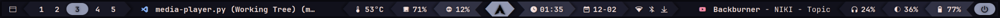

<div align="center">

  # Mechabar 🤖

  |                         |
  | :----------------------------------------------------: |

  <details>
    <summary><strong>&nbsp;🚀 Rofi Menus</strong></summary>
    <br />

  | 🛜 Wi-Fi and Bluetooth                                 |
  | :----------------------------------------------------: |
  |  <tr></tr>          |
  |  <tr></tr> |
  | `on-click-right`: **`nmtui`**, **`bluetui`** <tr></tr> |
  |        |

  | ⏸️ Logout                                              |
  | :----------------------------------------------------: |
  |                  |

  </details>

  <!-- Dark Mode -->

  <a href="https://github.com/sejjy/mechabar/stargazers#gh-dark-mode-only">
    </a>
  <a href="https://github.com/sejjy/mechabar/commits#gh-dark-mode-only">
    </a>
  <a href="https://github.com/sejjy/mechabar/contributors#gh-dark-mode-only">
    </a>

  <!-- Light Mode -->

  <a href="https://github.com/sejjy/mechabar/stargazers#gh-light-mode-only">
    </a>
  <a href="https://github.com/sejjy/mechabar/commits#gh-light-mode-only">
    </a>
  <a href="https://github.com/sejjy/mechabar/contributors#gh-light-mode-only">
    </a>
</div>  
<br />

A mecha-themed **[Waybar](https://github.com/Alexays/Waybar)** configuration initially designed for **[Hyprland](https://github.com/hyprwm/Hyprland)**, but also compatible with **Sway** and other **Wlroots-based compositors** with minimal adjustments. Contributions are welcome, including opening **[issues](https://github.com/sejjy/mechabar/issues)**, submitting **[pull requests](https://github.com/sejjy/mechabar/pulls)** for bug fixes or enhancements, and adding support for other distributions and compositors through new branches.

## Installation (Arch Linux)

### Automatic

1. **Clone the repository:**

   ```bash
   git clone https://github.com/sejjy/mechabar.git
   cd mechabar
   ```

2. **Run the [install](/install.sh) script:**

   ```bash
   ./install.sh
   ```

   This backs up existing folders and installs all [dependencies](#i-dependencies), configuration files, and scripts.

#

### Manual

#### I. Dependencies

```bash
sudo pacman -S bluez-utils brightnessctl hyprlock pipewire pipewire-pulse python ttf-jetbrains-mono-nerd wireplumber
```

```bash
yay -S bluetui rofi-lbonn-wayland-git
```

| Package                   | Description                                                                                         |
| ------------------------- | --------------------------------------------------------------------------------------------------- |
| `bluetui`                 | TUI for managing bluetooth devices <tr></tr>                                                        |
| `bluez-utils`             | Development and debugging utilities for the bluetooth protocol stack <tr></tr>                      |
| `brightnessctl`           | Lightweight brightness control tool <tr></tr>                                                       |
| `hyprlock`                | Hyprland's GPU-accelerated screen locking utility <tr></tr>                                         |
| `pipewire`                | Low-latency audio/video router and processor <tr></tr>                                              |
| `pipewire-pulse`          | Low-latency audio/video router and processor - PulseAudio replacement <tr></tr>                     |
| `python`                  | The Python programming language <tr></tr>                                                           |
| `rofi-lbonn-wayland-git`  | A window switcher, application launcher and dmenu replacement (fork with Wayland support) <tr></tr> |
| `ttf-jetbrains-mono-nerd` | Patched font JetBrains Mono from the nerd fonts library <tr></tr>                                   |
| `wireplumber`             | Session/policy manager implementation for PipeWire                                                  |

> [!IMPORTANT]
> If you use alternatives, you may need to modify the [scripts](/scripts/) and configuration files accordingly.

#

#### II. Installation

1. **Clone the repository:**

   ```bash
   git clone https://github.com/sejjy/mechabar.git
   cd mechabar
   ```

2. **Copy configuration files:**

   ```bash
   mkdir -p ~/.config/waybar/
   cp config.jsonc style.css theme.css ~/.config/waybar/
   ```

   ```bash
   mkdir -p ~/.config/rofi
   cp rofi/* ~/.config/rofi/
   ```

3. **Setup scripts:**

   ```bash
   mkdir -p ~/.config/waybar/scripts/
   cp scripts/* ~/.config/waybar/scripts/
   ```

   ```bash
   chmod +x ~/.config/waybar/scripts/*
   ```

4. **Restart Waybar to apply the changes:**

   ```bash
   killall waybar
   nohup waybar >/dev/null 2>&1 &
   ```

## Customization

- You can change the colors in [theme.css](/theme.css) and [theme.rasi](/rofi/theme.rasi) to match your system theme.
- You can remove existing modules or add new ones from the [modules](/modules/) folder. For a complete list of available modules, visit the [Waybar Wiki](https://github.com/Alexays/Waybar/wiki).

## Roadmap

Here are some features and improvements planned for future versions:

- [ ] Theme switcher
- [x] Install script
- [x] Rofi Bluetooth menu
- [x] Rofi logout menu

## Credits

- The original files in the [modules](/modules/) folder are from [prasanthrangan / hyprdots](https://github.com/prasanthrangan/hyprdots).
- Icons: [ryanoasis / nerd-fonts](https://github.com/ryanoasis/nerd-fonts)
- Color palette: [catppuccin / catppuccin](https://github.com/catppuccin/catppuccin) (Mocha)
