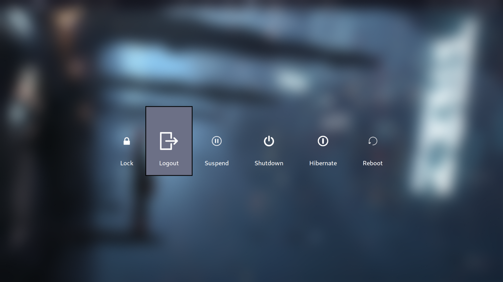
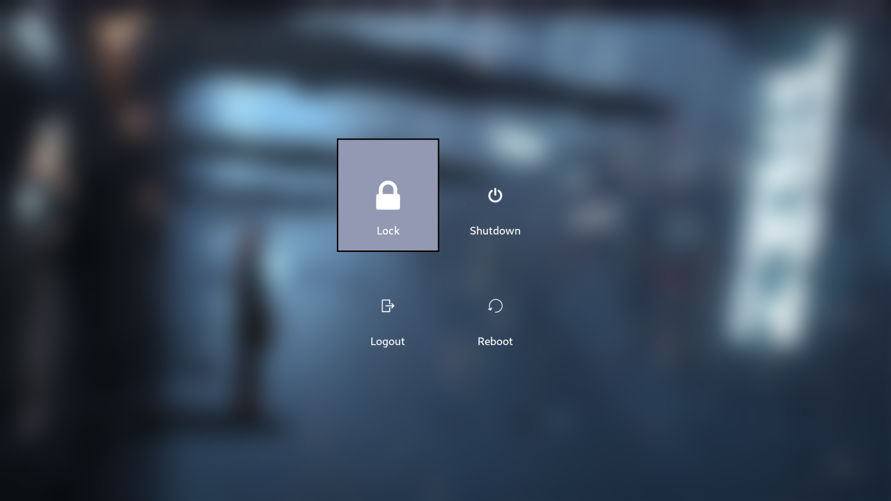
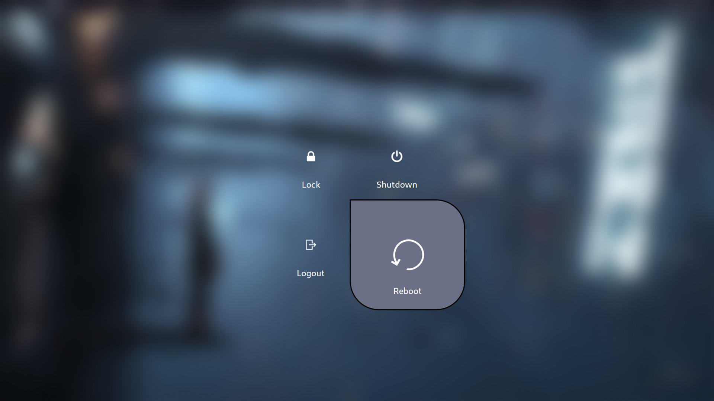

# Mecha Bar


<details>
    <summary>
        Wi-Fi Menu
    </summary>
        
</details>

<details>
    <summary>Logout Menu</summary>
    <table>
        <tr>
            <td></td>
            <td></td>
        </tr>
        <tr>
            <td></td>
            <td></td>
        </tr>
    </table>
</details>

## System Information
> **Note:** This configuration is initially tested and optimized for a **laptop** with the following system setup:

- **Operating System**: Arch Linux
- **Display Server**: Wayland
- **Window Manager**: Hyprland
- **Screen Resolution**: 1920x1080

## Dependencies
To ensure Mecha Bar works properly, install the following dependencies:

- ```pipewire``` - Low-latency audio/video router and processor
- ```wireplumber``` - Session / policy manager implementation for PipeWire
- ```playerctl``` - MPRIS media player controller and lib for spotify, vlc, audacious, bmp, xmms2, and others
- ```brightnessctl``` - Lightweight brightness control tool
- ```python``` - The Python programming language
- ```rofi``` - A window switcher, application launcher and dmenu replacement
- ```wlogout``` - A wayland based logout menu 
- ```ttf-jetbrains-mono-nerd``` - Patched font JetBrains Mono from nerd fonts library
- ```networkmanager``` - Network connection manager and user applications

## Installation
1. **Clone the repository:**
   ```bash
   git clone https://github.com/sejjy/mechabar.git
   cd mechabar
   ```
   
2. **Copy the configuration files:**
    
    Copy the `config.jsonc`, `style.css`, and `theme.css` files to `~/.config/waybar`:
    ```bash
    mkdir -p ~/.config/waybar/
    cp config.jsonc ~/.config/waybar/
    cp style.css ~/.config/waybar/
    cp theme.css ~/.config/waybar/
    ```

3. **Setup scripts:**
    
    Copy the `scripts` folder to `~/.config/waybar`:
    ```bash
    cp -r scripts ~/.config/waybar/
    ```

    Copy the scripts to `~/.local/share/bin`:
    ```bash
    mkdir -p ~/.local/share/bin
    cp scripts/* ~/.local/share/bin/
    ```

4. **Copy additional configuration files:**

    **Rofi**: Copy the files to `~/.config/rofi`:
    ```bash
    mkdir -p ~/.config/rofi
    cp -r rofi/* ~/.config/rofi/
    ```

    **Wlogout**: Copy the files to `~/.config/wlogout`:
    ```bash
    mkdir -p ~/.config/wlogout
    cp -r wlogout/* ~/.config/wlogout/
    ```

5. **Restart Waybar to apply the changes:**
    ```bash
    killall waybar
    waybar &
    ```

## Customization
You can modify the configuration files to match your setup. However, if you use alternative tools or dependencies, you'll need to adjust the scripts and configurations accordingly.

## Credits
This configuration uses base modules and scripts from **prasanthrangan**'s [hyprdots](https://github.com/prasanthrangan/hyprdots), which served as the foundation for this setup.

The color scheme is based on the **Catppuccin Mocha** palette. You can find more details on the official Catppuccin [website](https://catppuccin.com/palette).