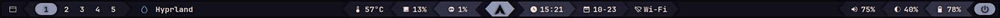
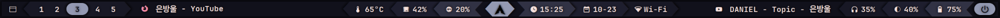
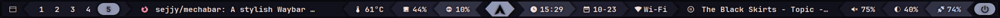

<h1 align="center" style="border-style: none;">🤖 Mechabar</h1>

<div align="center">
  <table>
    <tr>
      <td></td>
    </tr>
  </table>
  <table>
    <tr>
      <td></td>
    </tr>
  </table>
  <table>
    <tr>
      <td></td>
    </tr>
  </table>
</div>

<div align="center">
  <details>
    <summary><strong>&nbsp;🛜 Wi-Fi Menu</strong></summary>
    <br />
    <table>
      <tr>
        <td></td>
        <td></td>
      </tr>
      <tr>
        <td></td>
        <td></td>
      </tr>
    </table>
  </details>
</div>

<div align="center">
  <details>
    <summary><strong>&nbsp;⏸️ Logout Menu</strong></summary>
    <br />
    <table>
      <tr>
        <td></td>
        <td></td>
      </tr>
      <tr>
        <td></td>
        <td></td>
      </tr>
    </table>
  </details>
</div>

#

## Dependencies

To ensure _Mechabar_ works properly after [installation](#installation), install the following packages:

**Arch Linux:**

```bash
sudo pacman -S ttf-jetbrains-mono-nerd python networkmanager pipewire wireplumber playerctl brightnessctl jq
yay -S rofi-lbonn-wayland-git wlogout
```

|                           |                                                                                           |
| ------------------------- | ----------------------------------------------------------------------------------------- |
| `ttf-jetbrains-mono-nerd` | Patched font JetBrains Mono from the nerd fonts library                                   |
| `python`                  | The Python programming language                                                           |
| `networkmanager`          | Network connection manager and user applications                                          |
| `pipewire`                | Low-latency audio/video router and processor                                              |
| `wireplumber`             | Session/policy manager implementation for PipeWire                                        |
| `playerctl`               | MPRIS media player controller for Spotify, VLC, Audacious, BMP, XMMS2, and others         |
| `brightnessctl`           | Lightweight brightness control tool                                                       |
| `jq`                      | Command-line JSON processor                                                               |
| `rofi-lbonn-wayland-git`  | A window switcher, application launcher and dmenu replacement (fork with Wayland support) |
| `wlogout`                 | Logout menu for Wayland                                                                   |

> [!IMPORTANT]
> If you use alternatives, you _might_ need to adjust the [scripts](/scripts/) and configuration files accordingly.

## Installation

1. **Clone the repository:**

   ```bash
   git clone https://github.com/sejjy/mechabar.git
   cd mechabar
   ```

2. **Copy configuration files:**

   ```bash
   mkdir -p ~/.config/waybar/
   cp config.jsonc style.css theme.css ~/.config/waybar/
   ```

   **Rofi:**

   ```bash
   mkdir -p ~/.config/rofi
   cp -r rofi/* ~/.config/rofi/
   ```

   **Wlogout:**

   ```bash
   mkdir -p ~/.config/wlogout
   cp -r wlogout/* ~/.config/wlogout/
   ```

3. **Setup scripts:**

   **Waybar-exclusive:**

   ```bash
   cd scripts
   mkdir -p ~/.config/waybar/scripts/
   cp cpuinfo.sh cpuusage.sh wifiinfo.sh wifimenu.sh mediaplayer.py ~/.config/waybar/scripts/
   ```

   **System-wide:**

   ```bash
   mkdir -p ~/.local/share/bin/
   cp volumecontrol.sh brightnesscontrol.sh logoutlaunch.sh ~/.local/share/bin/
   ```

   **Make scripts executable:**

   ```bash
   chmod +x ~/.config/waybar/scripts/*
   chmod +x ~/.local/share/bin/*
   ```

4. **Restart Waybar to apply the changes:**

   ```bash
   killall waybar
   waybar &
   ```

## Customization

- You can change the colors in [theme.css](/theme.css) (for Waybar and Wlogout) and [theme.rasi](/rofi/theme.rasi) (for Rofi) to match your system theme.
- You can remove existing modules or add new ones from the [modules](/modules/) folder. For a complete list of available modules, visit the [Waybar Wiki](https://github.com/Alexays/Waybar/wiki).

## Credits

- This configuration uses base modules and scripts from **[prasanthrangan/hyprdots](https://github.com/prasanthrangan/hyprdots)**.
- The pastel color palette, or "flavor", used is **[Catppuccin Mocha](https://github.com/catppuccin/catppuccin/blob/main/docs/style-guide.md)**.
