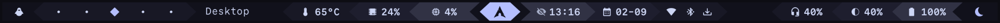

<div align="center">

## 🤖 mechabar

A customizable, modular Waybar configuration

|  |
| :---------------------------------------: |

<details>
<summary>Themes</summary>

| Catppuccin Mocha (default)                         |
| :------------------------------------------------: |
|  |

| Catppuccin Macchiato                                       |
| :--------------------------------------------------------: |
|  |

| Catppuccin Frappe                                    |
| :--------------------------------------------------: |
|  |

| Catppuccin Latte                                   |
| :------------------------------------------------: |
|  |

</details>
</div>

#

### Requirements

- [waybar](https://archlinux.org/packages/extra/x86_64/waybar/)

#

### Installation

1. Back up your current Waybar configuration:

	```bash
	mv ~/.config/waybar{,.bak}
	```

2. Clone the repository:

	```bash
	git clone https://github.com/sejjy/mechabar.git ~/.config/waybar
	```

3. Install the dependencies and restart Waybar:

	```bash
	~/.config/waybar/install
	```

	<details>
	<summary>Dependencies (6)</summary>

	| Package                | Command         | Description                                                                    |
	| ---------------------- | --------------- | ------------------------------------------------------------------------------ |
	| `bluez-utils`          | `bluetoothctl`  | Development and debugging utilities for the bluetooth protocol stack<tr></tr>  |
	| `brightnessctl`        | `brightnessctl` | Lightweight brightness control tool<tr></tr>                                   |
	| `fzf`                  | `fzf`           | Command-line fuzzy finder<tr></tr>                                             |
	| `networkmanager`       | `nmcli`         | Network connection manager and user applications<tr></tr>                      |
	| `pacman-contrib`       | `checkupdates`  | Contributed scripts and tools for pacman systems<tr></tr>                      |
	| `otf-commit-mono-nerd` |                 | Patched font Commit Mono from nerd fonts library                               |

	</details>

#

### Configuration

<details>
<summary>Fonts</summary>

Different fonts render characters in different sizes, which can affect the layout.
Import your preferred font file from the [fonts](./styles/fonts/) directory to `style.css`.
For example:

```css
/* @import "styles/fonts/commit-mono.css"; */
@import "styles/fonts/jetbrains-mono.css";
```

#

</details>

<details>
<summary>Themes</summary>

To change the theme, import your preferred theme file from the [themes](./styles/themes/) directory to `style.css`.
For example:

```css
/* @import "styles/themes/catppuccin-mocha.css"; */
@import "styles/themes/catppuccin-latte.css";
```

#

</details>

<details>
<summary>Icons</summary>

You can search for icons on [Nerd Fonts: Cheat Sheet ↗](https://www.nerdfonts.com/cheat-sheet).
For example:

```
gentoo
```

_Matches: `nf-dev-gentoo`, `nf-linux-gentoo`, `nf-md-gentoo`*_

_*Most modules use Material Design Icons (`nf-md-*`) for consistency._

#

</details>

<details>
<summary>Custom module</summary>

The leftmost module has no default function and is _left_ for you to configure.
For example:

```jsonc
// ~/.config/waybar/modules/custom/user.jsonc

"custom/user": {
	"on-click": "/path/to/your/script", // Run your own script
	"on-click-right": "pkill -SIGUSR2 waybar", // Restart Waybar
}
```

</details>

#

### References

- [Waybar wiki](https://github.com/Alexays/Waybar/wiki)
- [Nerd Fonts wiki: Glyph Sets](https://github.com/ryanoasis/nerd-fonts/wiki/Glyph-Sets-and-Code-Points)
