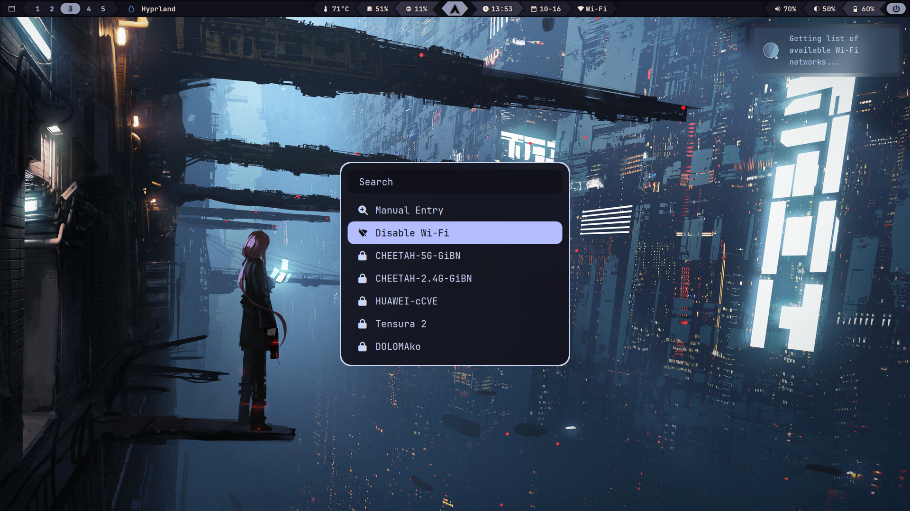

<h1 align="center" style="border-style: none;">🤖 MechaBar</h1>


<div align="center">
    <details>
        <summary><strong>&nbsp;🛜 Wi-Fi Menu</strong></summary>
        <br>
        
    </details>
</div>

<div align="center">
    <details>
        <summary><strong>&nbsp;⏸️ Logout Menu</strong></summary>
        <br>
        <table>
            <tr>
                <td></td>
                <td></td>
            </tr>
            <tr>
                <td></td>
                <td></td>
            </tr>
        </table>
    </details>
</div>

#

> [!NOTE]
> This configuration is used for a **laptop** with the following system setup:

- Arch Linux
- Wayland
- Hyprland
- `monitor = DP-1, 1920x1080@60, 0x0, 1`

## Dependencies

To ensure _MechaBar_ works properly after [installation](#installation), install the following dependencies:

```bash
# For Arch
sudo pacman -S pipewire wireplumber playerctl brightnessctl python ttf-jetbrains-mono-nerd networkmanager
yay -S rofi-lbonn-wayland-git wlogout
```

|                           |                                                                                           |
| ------------------------- | ----------------------------------------------------------------------------------------- |
| `pipewire`                | Low-latency audio/video router and processor                                              |
| `wireplumber`             | Session/policy manager implementation for PipeWire                                        |
| `playerctl`               | MPRIS media player controller for Spotify, VLC, Audacious, BMP, XMMS2, and others         |
| `brightnessctl`           | Lightweight brightness control tool                                                       |
| `python`                  | The Python programming language                                                           |
| `rofi-lbonn-wayland-git`  | A window switcher, application launcher and dmenu replacement (fork with Wayland support) |
| `wlogout`                 | Logout menu for wayland                                                                   |
| `ttf-jetbrains-mono-nerd` | Patched font JetBrains Mono from the nerd fonts library                                   |
| `networkmanager`          | Network connection manager and user applications                                          |

> [!IMPORTANT]
> If you use alternatives, you might need to adjust the [scripts](/scripts/) and configuration files accordingly.

## Installation

1. **Clone the repository:**

   ```bash
   git clone https://github.com/sejjy/mechabar.git
   cd mechabar
   ```

2. **Copy configuration files:**

   ```bash
   mkdir -p ~/.config/waybar/
   cp config.jsonc style.css theme.css ~/.config/waybar/

   # Wi-Fi Menu
   mkdir -p ~/.config/rofi
   cp -r rofi/* ~/.config/rofi/

   # Logout Menu
   mkdir -p ~/.config/wlogout
   cp -r wlogout/* ~/.config/wlogout/
   ```

3. **Setup scripts:**

   ```bash
   # Waybar-exclusive scripts
   mkdir -p ~/.config/waybar/scripts/
   cp scripts/wifimenu.sh scripts/mediaplayer.py scripts/essid.sh scripts/cpuinfo.sh ~/.config/waybar/scripts/

   # System-wide scripts
   mkdir -p ~/.local/share/bin/
   cp scripts/volumecontrol.sh scripts/brightnesscontrol.sh scripts/logoutlaunch.sh ~/.local/share/bin/

   # Make scripts executable
   chmod +x ~/.config/waybar/scripts/*
   chmod +x ~/.local/share/bin/volumecontrol.sh ~/.local/share/bin/brightnesscontrol.sh ~/.local/share/bin/logoutlaunch.sh
   ```

4. **Restart Waybar to apply the changes:**

   ```bash
   killall waybar
   waybar &
   ```

## Customization

> [!TIP]
> You can change the colors in [style.css](/style.css) and [theme.css](/theme.css) to match your system theme.

- You can remove existing modules or add new ones from the [modules](/modules/) folder. For a complete list of available modules, visit the [Waybar Wiki](https://github.com/Alexays/Waybar/wiki).

## Credits

- This configuration uses base modules and scripts from **[prasanthrangan/hyprdots](https://github.com/prasanthrangan/hyprdots)**.
- The pastel color palette, or 'flavor', used is **[Catppuccin Mocha](https://github.com/catppuccin/catppuccin/blob/main/docs/style-guide.md)**.
